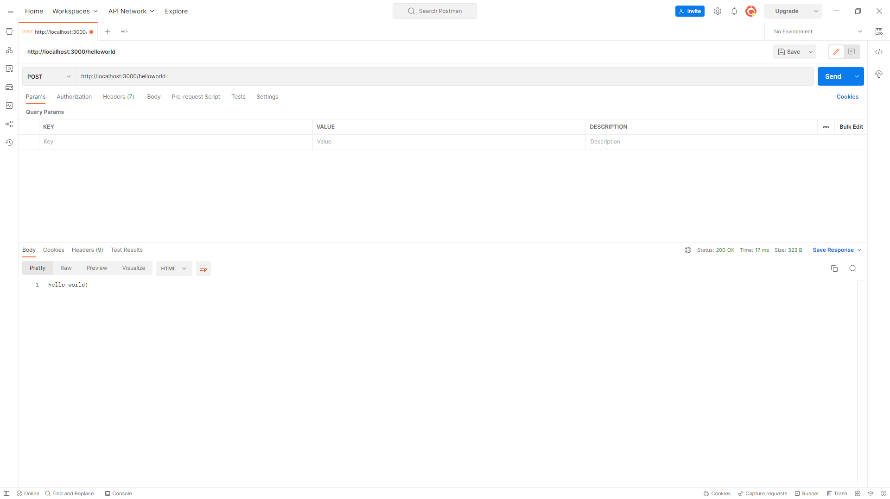

# Running the API Locally

## Testing Your Code Locally

In order to test our code locally, we have a few options. We can use in-built web-request commands that are featured within your Operating System's terminal or we can use a REST API Caller program like [Postman](https://www.postman.com/) or [Insomnia](https://insomnia.rest/). You can access them and download one by hitting the respective links.

To run your API locally, we must now get our terminal to be in the same folder as our root folder for our API. If you opened your terminal via VS Code, you can skip this next step and get straight to running some commands!

## Getting your Terminal to the right directory

This can be an annoying task to undertake but luckily, we have an easy way to complete it!

On a Windows computer, you can open the folder in Windows Explorer. In the top left, you can hit `File` and hover open `Open Windows Powershell` to open the terminal in that folder. 

On a Mac computer, you can right click on the folder, which will open a context menu that has the option `Services`. If you go down and hover over, you can hit `New Terminal at Folder` which will open the terminal in that folder. 

## Testing your Code Locally

Now that we are in the right folder, we can now test the code. We can test the code by running `oneblink api serve`. After running this, you should get a confirmation similar to this:

Now, using Postman in this example, we can test this endpoint. In Postman, I set the type of method to `GET` and I write in the url of `localhost:3000/positions`. Now upon hitting submit:

Success! We can see our code has worked perfectly, it has returned our option set we are going to use! Now, we can deploy it!
