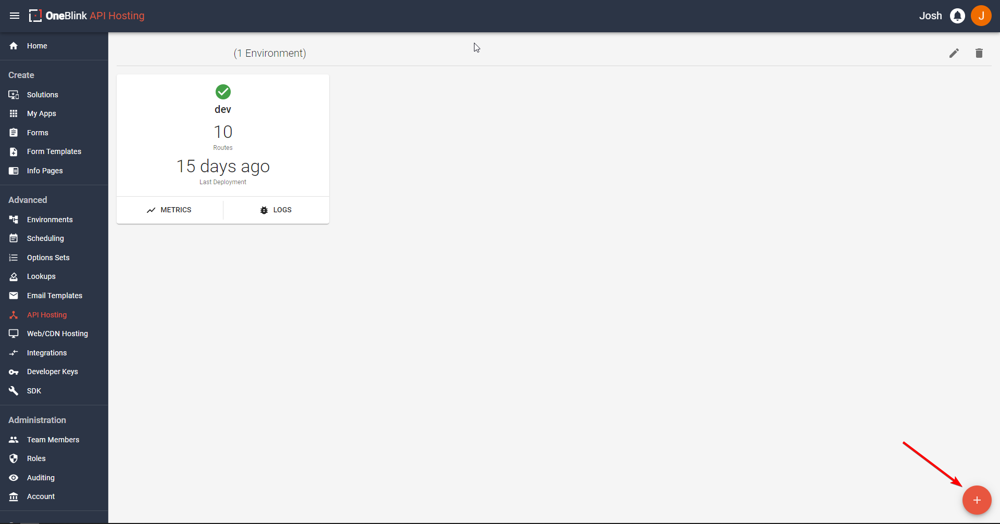
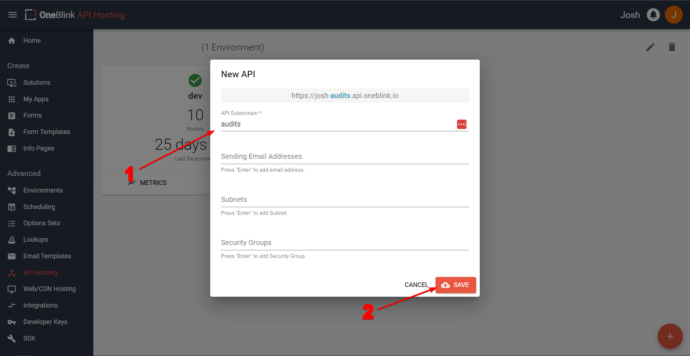

# Creating the API

## Creating the API on the OneBlink Console

Firstly, we will need to make sure we have something to deploy to when we are ready. Let us go onto the [OneBlink Console](https://console.oneblink.io) or if you are a Civicplus customer, [Civic Optimize](https://console.transform.civicplus.com). All screenshots will be taken on the OneBlink Console but, only the colour scheme will be different if you are a Civic Optimize user. All Terminal commands will remain the same but replace "oneblink" with "civicplus". 

Once we are in our account, go to the "API Hosting" side tab under the Advanced heading. Once here, let us click the plus button in the bottom right hand corner.



It's time to fill out some information. We only need to fill in the API subdomain, so call the subdomain what you would like. In my example, I will call it "audits".



Now you should see it featured with no environments as shown below. Now, we can get onto the fun part!

## Create a Folder and call it whatever you want

This folder will be the central spot for all of your API work. In this folder, we are going to create a few important files to start off with. The first file we will create is the `.blinkmrc.json` file. This stores all the important information regarding your routes, api name, AWS Lambda configuration and much more. We won't overload you with all the different choices you have in it yet, but first we will create this file and you can copy this template over!

```json
{
  "server": {
    "project": "your-api-name-here.api.oneblink.io",
    "routes": [
      {
        "route": "",
        "module": ""
      }
    ],
    "cors": true
  }
}
```

This will be updated later on in the guide. But for now, please change the project name to what you made your api name in the OneBlink Console or Civic Optimize.

Next, in the folder, create another folder called "src" then, create a folder within "src" called "routes". Shown below:

Now, if we are using VSCode with windows, you can open a terminal with <code>crtl+shift+\`</code>. 
If you're using a Mac with VSCode, you can open a terminal with <code>command+shift+\`</code>

If not, you will need to open your terminal and manually direct it to the root of the folder you have just created.

If you are a OneBlink Console user, you will write:

```bash
  oneblink api scope accountName-apiSubDomain.api.oneblink.io
```

If you are using Civic Optimize, you will write: 

```bash
  civicplus api scope accountName-apiSubDomain.api.transform.civicplus.com
```

You will need to replace accountName with your accountName and replace the apiSubDomain with the Sub Domain you wrote. In this case, mine would be `josh-audits.api.oneblink.io`.

## An Example Option Set

Now, in the `Routes` folder, let us create a JavaScript file called 'positions.js'. This will be an example option set that we will create.

Place the code below into the newly created file.

```js
module.exports.get = function () {
  return [
    {
      value: "Marketing",
      label: "Marketing",
    },
    {
      value: "Engineering",
      label: "Engineering",
    },
    {
      value: "Coding",
      label: "Coding",
    },
    {
      value: "Operations",
      label: "Operations",
    },
  ];
};
```

To explain, in this module, we are exporting this function named `get` to return an array (noted by []) of JSON (noted by {}, which stands for Javascript Object Notation) with values and labels for our option set. The Label is what will be shown to the front-end user while the value is what we will use for back-end functionality.

Please keep in mind, that there is another way of writing these functions involving ES Modules, you can see how to update the function to use that method [here](./upgrading-to-es-modules.md)

## Updating the `.blinkmrc.json` file

Save your file and jump back into the `.blinkmrc.json` file.

Under `routes`, we are going to add this file to the routes so it can be accessed. Now, where it says `route`, we are going to replace with the route that we want to access this API with via a link. For Example: `/api/generic-option-set`. When this is attached to the end of the hosted API name you set in your project, it will access that code you have written.

Replace the route we copied over before with:

```json
{
  "route": "/position",
  "module": "./src/routes/position.js"
}
```

For example, the link for me would become: `josh-audits.api.oneblink.io/position`.

Now, your whole `.blinkmrc.json` file should look like this:

```json
{
  "server": {
    "project": "your-api-name-here.api.oneblink.io",
    "routes": [
      {
        "route": "/position",
        "module": "./src/routes/position.js"
      }
    ],
    "cors": true
  }
}
```

Now that we have replaced this, we can login via the CLI!
