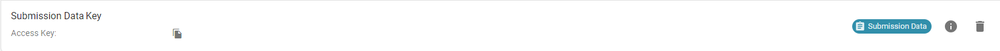

- [Obtaining Developer Keys](#obtaining-developer-keys)

## Obtaining Developer Keys

In order to use the OneBlink SDK, we will need a developer key. 

There are two types of keys we can create:

- Role Based Key
- Submission Data Key

In this tutorial, we are going to create a Submission Data Key. We can generate these on the Console. You must have sufficient role permissions in order to do so. This can be set under 'Roles' on the side bar under the 'Advanced' heading. Once in, you can edit an existing role by clicking the three buttons or you can add a new role by hitting the orange button in the bottom right. 

After you have sufficient role permissions, we will now navigate to "Developer Keys" under the "Developer" heading on the side bar.
On this page, we will hit the add button in the bottom right. A modal should pop up. In here, you can set the name that you would like the key to be called. You can select the type of key you want to generate. If you select the "Role Based Key", you can select the role you want to associate with the key. We will select "Submission Data Key".  You can see this in the screenshot below: 


After generating this key, a modal will appear that includes your Access Key and your Secret Key. Your Secret Key will be inaccessible after this point, as the warnings indicate, so make sure you save your key details somewhere secure. After closing that modal, you will see your key in the list as so:



After creating your key, you will need to associate it with a form to allow the key to be used. You can do this by navigating to "Forms" on the side bar. Open the form you would like to associate the key with. On the Developer Tools screen, you can see this card towards the bottom of the page. 


You can hit "Assign Developer Key" which will open the modal below: 


You can select your new Submission Data Key then hit save. This will add it to your list of allowed Developer Keys for the form. Now, we can get into updating our code!

## Updating the Code

Now we need to go into our code and utilise the OneBlink SDK. 

### Create a new Forms Object

Firstly, we need to use the Forms object from the OneBlink SDK. Let us add this code to the top of our file we are working on:

```js
const forms = require("@oneblink/sdk/tenants/oneblink");
```

If you are using ES Modules, you can instead write:

```js
import { Forms } from '@oneblink/sdk/tenants/oneblink'
```

You can find out more about converting your functions to ES Module with [this article](./upgrading-to-es-modules.md).

Now that we have imported formsApp from the OneBlink SDK, we will need to grab our key that we generated on the Console before. 
Here we will write:

```js
  const formsClient = new Forms({
    accessKey: YOUR_ACCESS_KEY,
    secretKey: YOUR_SECRET_KEY,
  })
```
replacing the values with the respective values from the Console. You can place this inside, or outside of your function.

Now that you have this object, you can access functions from the Forms class of the OneBlink SDK. You can find that documentation [here](https://oneblink.github.io/sdk-node-js/classes/oneblink.Forms.html). 

