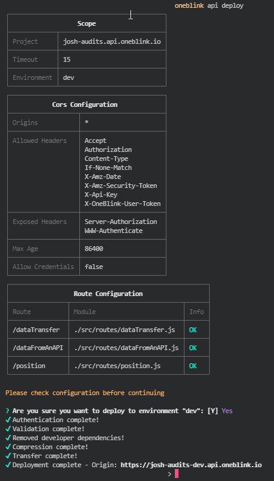
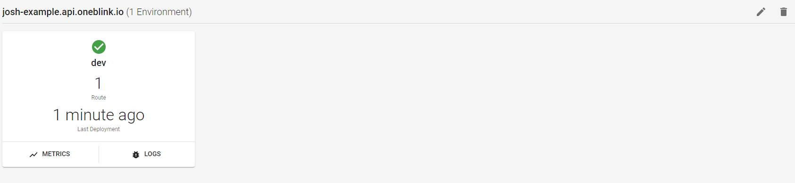
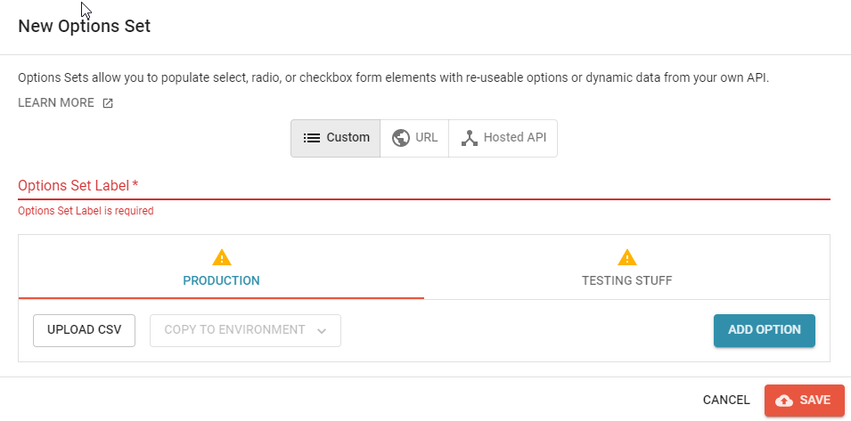
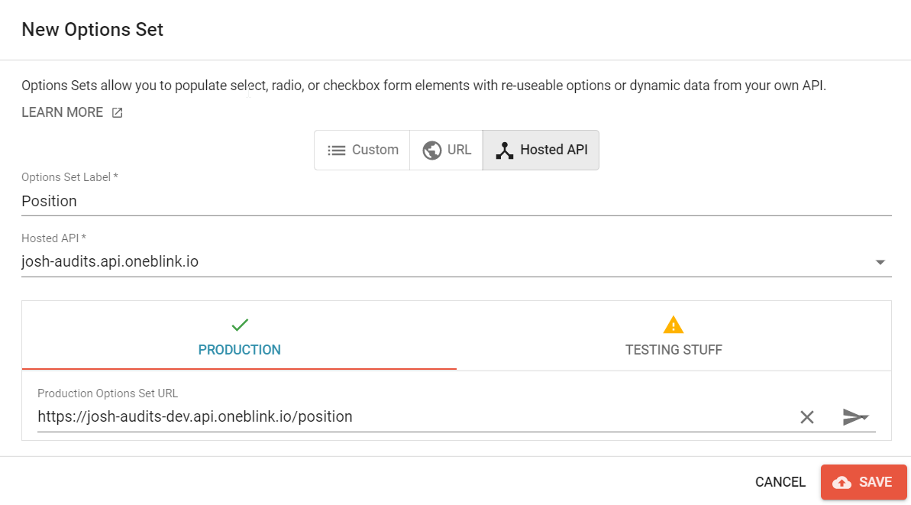
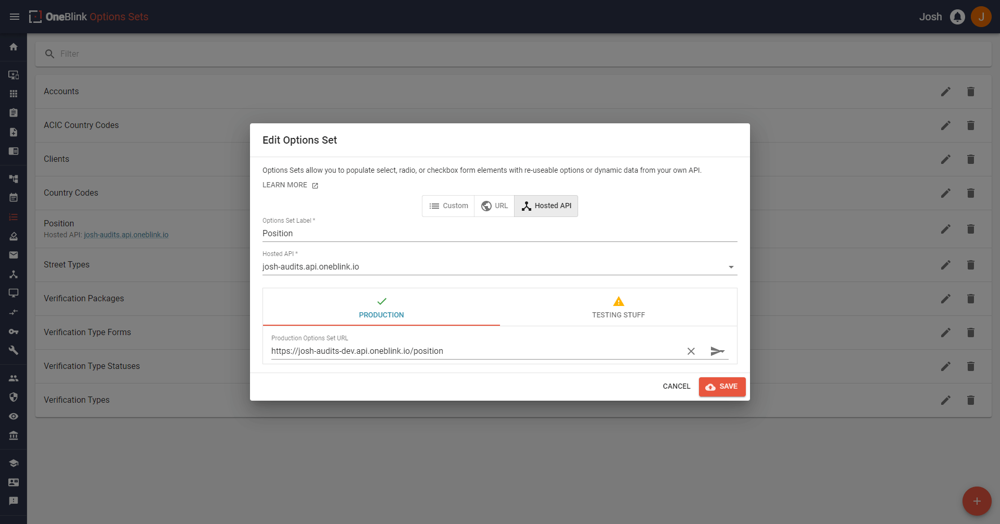
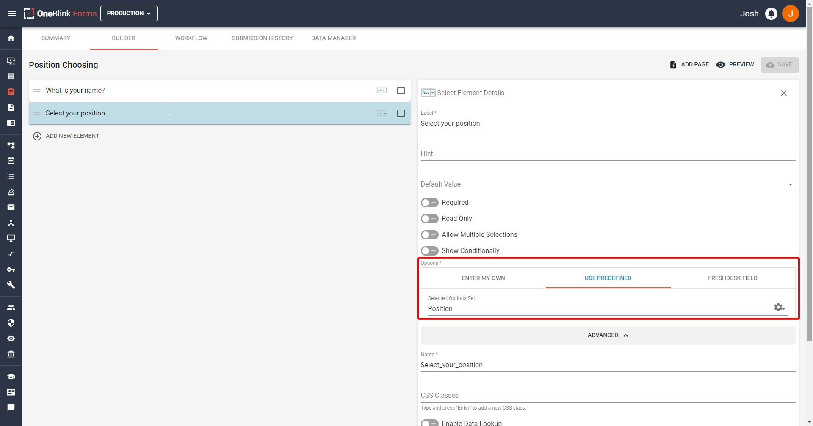
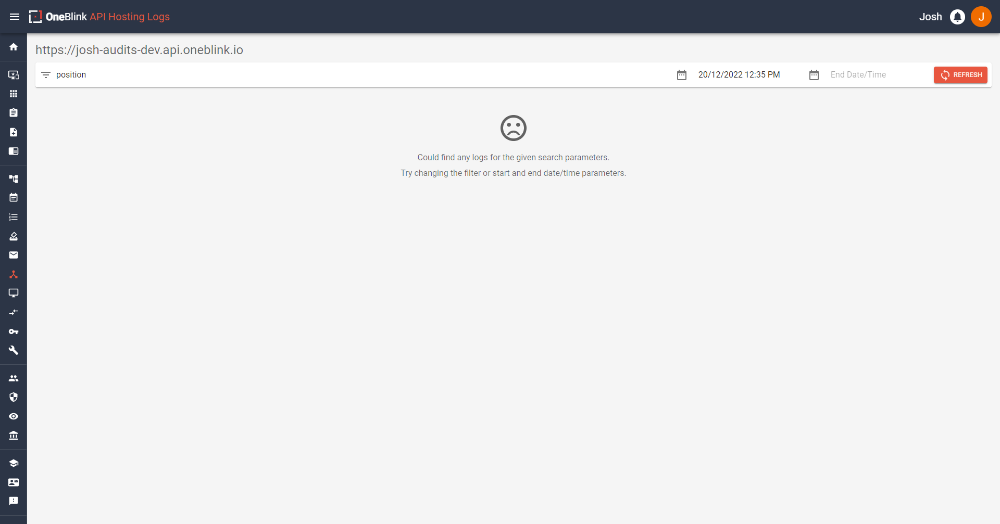
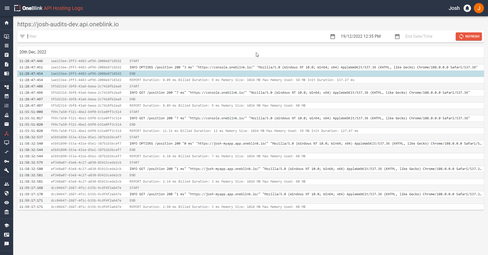

# Hosting your API with OneBlink

## Deploying your API

Now we are at the fun stage, deploying our newly created API.

If everything is still setup from the past few steps, then we will be good to go. If not, you will have to ensure that you have logged into the OneBlink CLI and that you are in the right folder in your terminal.

Now we can run the command

`oneblink api deploy`

After running this, you will get text in your terminal if it is okay to deploy to that environment, most likely named 'dev'. If that is fine, you can hit `y` and enter, then you're good to go! 



 Go check the OneBlink Hosted API page and give it a refresh if required. You should see your brand new shiny API!



Now, you have learnt the steps required to write your own code and host your own API! 

Now that the API is hosted, we still need to setup our Option Set we wrote onto a form, so let us do that!

## Setting up the Option Set

We have the code on the OneBlink Console so now we have to setup our option set. On the left tab, we will need to hit "Option Sets" under the "Advanced" heading. After this, you will need to hit the orange "+" button at the bottom right of the screen.

This will open up a modal as shown below:



You will need to hit the "Hosted API" button. After hitting this, you will need to put in an Options Set Label, which we will make "Positions" to match the file name in this instance. We will then set the Hosted API to the one we deployed. After this, we have a different environments featured below in the box in case we want a different endpoint for different environments. In this case, choose the environment you want to use, I will be choosing Production and choose the endpoint we uploaded there. It should look like this



To make sure this is working, we can test it by hitting that arrow on the right of the row. If you hit it and it works, you should see something like this, which if you hit the green tick that appears:



Now we have our option set, let us go setup a form with it!

## Setting up a form with an Option Set

Now we can create a new form that will utilise this option set we have made. It does not have to be complex so let us make a simple form. Name the form whatever you want, and go to the form builder page.

We will create two elements, a text element and a select element.
The text element's label will be "What is your name?" and the select element will be "Select your position". Within the select element, we will need to choose the "Use prefined" field.

From here, we can hit the option of Selected Options Set and choose our newly created "Positions" option set as shown below. 



With this, we can see the Option Set in action!

## Testing the Option Set

Alright, let us open the form and give it a quick test:


Eureka, it worked! Now we know how to set up this new Option Set.

Let me present you with another situation though, what if, we had an error return INSTEAD of it succeeding? It is possible that when you write other end points, you will have error handling in your code that might throw when something happens, or another error could occur that you were not anticipating! We need to be able to check and understand what has gone wrong!
Luckily, we have logs for the hosted API that you can view, so let's have a look at that now!

## Viewing Logs and Viewing Metrics

A keen eye would have seen in an earlier screenshot that these buttons existed on the API hosting page, which is where we will be going back to. We have both the Metrics Button and Logs button featured underneath the respective API's environment. If you had multiple environments, you would see metrics and logs buttons for each. First, let's look at the metrics page, so hit the metrics button for your hosted API!

### Metrics

You can see what the metrics screen looks like below:


On this page, from top to bottom, you can see the named API and its environment in the top left of the page. You have 5 buttons on the right, reading 60 minutes, 6 hours, 24 hours, 7 days and 30 days from left to right for time periods you can select to view the metrics of.

Additionally, you will see 3 boxes. These boxes will contain graphs or, if you're lucky enough to have no 4xx or 5xx HTTP responses, you will see a green tick with a nice message. If you are not lucky enough, these will also contain graphs that you can look at. 
These metrics can provide insight into the traffic that you are receiving from your API. 

### Logs

You can see what the logs screen looks like below:



From top to bottom again, you can see the API link with its environment in the top left then below that is a filter bar. 

Here you can filter on a search parameter, a start time, and end time and a refresh button to search with those parameters. The search parameter will let you search your API logs for those parameters and it will return any that matches. The start date time and end date time will allow you to configure the time range that you would like to investigate logs for. 

Below that, we have the area where logs are shown, in the screenshot above, you can see that it has a sad face with a message indicating that there were no logs found. You can change your time period to see if you can locate any other logs. If you have been following along, you should have some from the calls made earlier, so hit the start date and change it to yesterday, then hit refresh!

Now you will hopefully see something like this: 



When logs do appear, they are in a box and show the date they occurred up the top. There will be a box for each respective day. Looking at a row, you can see the time this occurred, the request id, and what occurred at that time. The logs will provide information regarding any information you have written to the Console via your code (through methods such as ```console.log()```, ```console.error()``` or anything equivalent.)

