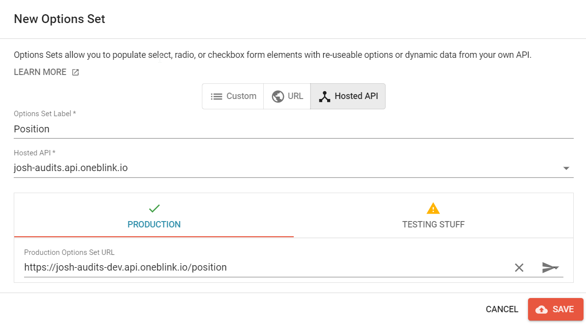
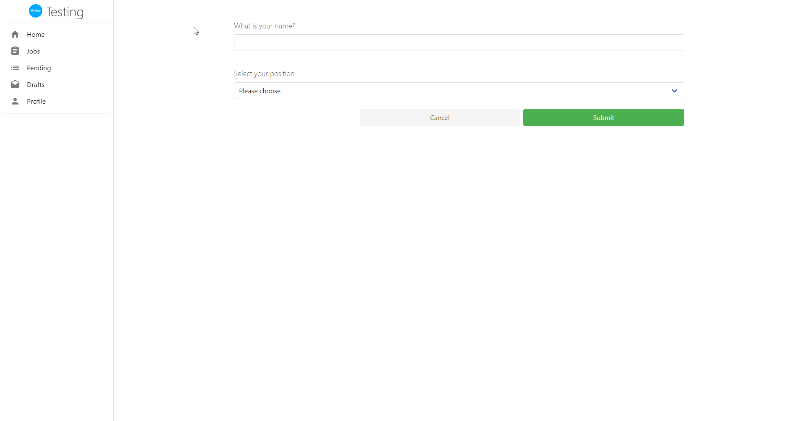

# Integrating API Routes

- [Creating the Option Set](#creating-the-option-set)
- [Setting up the Option Set](#setting-up-the-option-set)
- [Setting up a Form with an Option Set](#setting-up-a-form-with-an-option-set)
- [Testing the option set](#testing-the-option-set)

## Creating the Option Set

First, let us create a JavaScript file called `positions.js` in our API. This will be an example option set that we will create.

Place the code below into the newly created file.

```js
module.exports.get = function () {
  return [
    {
      value: "Marketing",
      label: "Marketing",
    },
    {
      value: "Engineering",
      label: "Engineering",
    },
    {
      value: "Coding",
      label: "Coding",
    },
    {
      value: "Operations",
      label: "Operations",
    },
  ];
};
```

To explain, in this module, we are exporting this function named `get` to return an array (noted by []) of JSON (noted by {}, which stands for Javascript Object Notation) with values and labels for our option set. The Label is what will be shown to the front-end user while the value is what we will use for back-end functionality.

Please keep in mind, that there is another way of writing these functions involving ES Modules, you can see how to update the function to use that method [here](./upgrading-to-es-modules.md)

## Updating the `.blinkmrc.json` file

Save your file and jump back into the `.blinkmrc.json` file.

Under `routes`, we are going to add this file to the routes so it can be accessed. Now, where it says `route`, we are going to replace with the route that we want to access this API with via a link. For Example: `/api/generic-option-set`. When this is attached to the end of the hosted API name you set in your project, it will access that code you have written.

Replace the route we copied over before with:

```json
{
  "route": "/position",
  "module": "./routes/position.js"
}
```

For example, the link for me would become: `josh-audits.api.oneblink.io/position`.

Now, your whole `.blinkmrc.json` file should look like this:

```json
{
  "server": {
    "project": "your-api-name-here.api.oneblink.io",
    "routes": [
      {
        "route": "/position",
        "module": "./routes/position.js"
      }
    ],
    "cors": true
  }
}
```

You need to ensure that you update your "project" variable to match the name of the API that you set within the Console. Please ensure that while updating the routes, you do that too!

## Setting up the Option Set

We have the code on the OneBlink Console so now we have to setup our option set. On the left tab, we will need to hit "Option Sets" under the "Developer" heading. After this, you will need to hit the orange "+" button at the bottom right of the screen.

This will open up a modal as shown below:


You will need to hit the "Hosted API" button. After hitting this, you will need to put in an Options Set Label, which we will make "Positions" to match the file name in this instance. We will then set the Hosted API to the one we deployed. After this, we have a different environments featured below in the box in case we want a different endpoint for different environments. In this case, choose the environment you want to use, I will be choosing Production and choose the endpoint we uploaded there. It should look like this



To make sure this is working, we can test it by hitting that arrow on the right of the row. If you hit it and it works, you should see something like this, which if you hit the green tick that appears:


Now we have our option set, let us go setup a form with it!

## Setting up a form with an Option Set

Now we can create a new form that will utilise this option set we have made. It does not have to be complex so let us make a simple form. Name the form whatever you want, and go to the form builder page.

We will create two elements, a text element and a select element.
The text element's label will be "What is your name?" and the select element will be "Select your position". Within the select element, we will need to choose the "Use prefined" field.

From here, we can hit the option of Selected Options Set and choose our newly created "Positions" option set as shown below. 


With this, we can see the Option Set in action!

## Testing the Option Set

Alright, let us open the form and give it a quick test:



Eureka, it worked! Now we know how to set up this new Option Set.

Let me present you with another situation though, what if, we had an error return INSTEAD of it succeeding? It is possible that when you write other end points, you will have error handling in your code that might throw when something happens, or another error could occur that you were not anticipating! We need to be able to check and understand what has gone wrong!