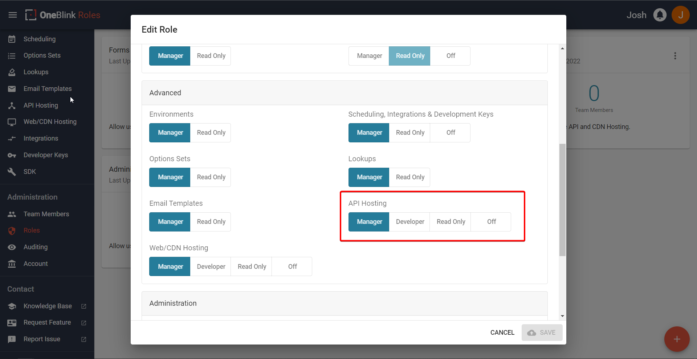

# Logging In with the OneBlink CLI

## Enabling the right permissios on the Console

In order to utilise the CLI to its fullest extent, you will need to ensure that you have the right permissions set on the Console/Civic Optimize. 

You can find the related permissions in roles on the side tab under Administration. You can choose to edit an existing role or you can add a new one. After the modal has opened, if you are to scroll down, you can find 'API Hosting' under the 'Advanced' heading. This is shown below: 

You can see there are 4 options. You can read what each permission will let you do by hovering over it and reading the tooltip, but we can give an extended understanding here. So:

- Manager
    - Selecting this option will let you to create and delete hosted APIs on the Console. You will also be able to deploy environments and code changes to the API through the OneBlink CLI. 
- Developer
    - Selecting this option will let you deploy environments and code changes to the API through the OneBlink CLI. You will be able to view the APIs on the Console. 
- Read Only
    - The name might give it away but, you are only able to view the APIs on the Console with this permission. 
- Off
    - Another obvious one but, you have no permissions in regards to API Hosting. 

That explains each of the permissions! Make sure you sent the right one if you want to deal with deploying API changes!
## Logging in

Before we can do anything with the OneBlink CLI, we have to log in first. So, let us get our terminal opened first!

Open up your respective terminal again depending on your OS.

If you are using VS Code, you can open the terminal pressing <code>crtl+shift+\`</code> on Windows or <code>command+shift+\`</code> on Mac.

If you are not, you can open the terminal the same way you have previously.

After you have opened the terminal, you can login by typing:

`oneblink login`

You will have your default browser open where you can login. After logging in, you will be given a code that you can copy and paste into your terminal.

After copying the code, we are now able to use the CLI functions for our API!
