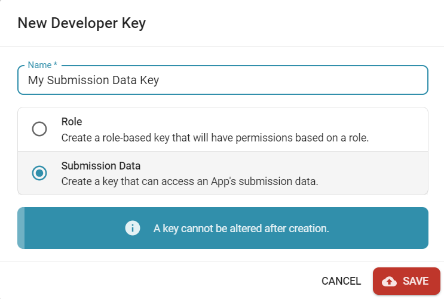

# Securing your API

- [Installing the OneBlink SDK in our code](#installing-the-oneblink-sdk-in-our-code)
- [Obtaining Developer Keys](#obtaining-developer-keys)
- [Updating the Code](#updating-the-code)

## Installing the OneBlink SDK in our code

Securing code is something that's important to do. It will ensure that we are protecting our API Routes and allowing only correct users to run our end points. We can do this through the [OneBlink SDK](https://oneblink.github.io/sdk-node-js/). This means we are going to utilise Node to get the OneBlink SDK in our project. 

If you are using VS Code, you can open the terminal by pressing <code>crtl+shift+\`</code> on Windows or <code>command+shift+\`</code> on Mac.

With the open terminal in our API folder, we can run:

```bash
npm install --save @oneblink/sdk
```

This will install the OneBlink SDK to that project. If this is your first package install, it will create a folder named `node_modules` and create 2 files named `package.json` and `package-lock.json`. 

If you haven't seen these files and folder before, you can read this explanation below. If you have, skip to the next heading. 

`node_modules` is where all the code for the installed packages is stored. `package.json` is used to provide important information regarding the project. It shows you the name of the project, installed dependencies and developer dependencies. It can display the version of the current project and provide you a place to write scripts that node can run for you. `package-lock.json` shows all of the required code to install specific packages, this includes all of that packages dependencies so you can have a full guide to what has been installed. This helps Node understand what has been installed and change only necessary data on later installations. 

Now that we have installed the SDK, we can go obtain some developer keys from the Console!

## Obtaining Developer Keys

In order to use the SDK, we will need a developer key. 

There are two types of keys we can create:

- Role Based Key
- Submission Data Key

In this tutorial, we are going to create a Submission Data Key. We can generate these on the Console. You must have sufficient role permissions in order to do so. This can be set under 'Roles' on the side bar under the 'Advanced' heading. Once in, you can edit an existing role by clicking the three buttons or you can add a new role by hitting the orange button in the bottom right. 

After you have sufficient role permissions, we will now navigate to "Developer Keys" under the "Developer" heading on the side bar.
On this page, we will hit the add button in the bottom right. A modal should pop up. In here, you can set the name that you would like the key to be called. You can select the type of key you want to generate. If you select the "Role Based Key", you can select the role you want to associate with the key. We will select "Submission Data Key".  You can see this in the screenshot below: 



After generating this key, a modal will appear that includes your Access Key and your Secret Key. Your Secret Key will be inaccessible after this point, as the warnings indicate, so make sure you save your key details somewhere secure. After closing that modal, you will see your key in the list as so:


After creating your key, you will need to associate it with an app to allow the key to be used. You can do this by navigating to "Apps" on the side bar. Open the app you would like to associate the key with. On the Summary screen, you can see this card towards the bottom of the page. 


You can hit "Assign Developer Key" which will open the modal below: 


You can select your new Submission Data Key then hit save. This will add it to your list of allowed Developer Keys for the app. Now, we can get into updating our code!

## Updating the Code

Now we need to go into our code and create some checks to ensure that the user is valid. The steps we will go through to achieve this are:

- [Create a new FormsApp Object](#create-a-new-formsapp-object)
- [Use the VerifyJWT function from FormsApp](#use-the-verifyjwt-function-from-formsapp)

Now let us go down the list!

### Create a new FormsApp Object

Firstly, we need to use the FormsApp object from the OneBlink SDK. Let us add this code to the top of our file we are working on:

```js
const formsApp = require("@oneblink/sdk/tenants/oneblink");
```

If you are using ES Modules, you can instead write:

```js
import { FormsApps } from '@oneblink/sdk/tenants/oneblink'
```

You can find out more about converting your functions to ES Module with [this article](./upgrading-to-es-modules.md).

Now that we have imported formsApp from the OneBlink SDK, we will need to grab our key that we generated on the Console before. 
Here we will write:

```js
  const formsAppsClient = new FormsApps({
    accessKey: YOUR_ACCESS_KEY,
    secretKey: YOUR_SECRET_KEY,
  })
```
replacing the values with the respective values from the Console. You can place this inside, or outside of your function.

### Use the VerifyJWT function from FormsApp

After this, in your function, you can use this code to verify your user:

```js
    const authenticationHeader = req.headers.authorization
    if (typeof authenticationHeader !== 'string'){
      return res.setStatusCode(400).setPayload({
        message: "Error, no user logged in. User must be logged in."
      });
    }

    const token = authHeader.split(' ')[1]
    const jwtPayload = await formsAppClient.verifyJWT(token)
```

Alright so let's break this down.
First, we are grabbing the authentication header from the request header that was sent to the API. After this, we are checking to see if the header is of type string. If it is not, the user has NOT logged in! That means we cannot authenticate them! In this case, we will return a 400 on the `res` object with `setPayload(400)` to return a 400 HTTP code and use `setPayload({message: 'Error, no user logged in. User must be logged in.'})` as the payload with an error message. 
If there is an authentication header, we can split it based on white spaces and grab the value at the '1' index. This will provide us with the JWT token. After this, we can run the function [verifyJWT()](https://oneblink.github.io/sdk-node-js/classes/oneblink.FormsApps.html#verifyJWT) with the token to verify who the user is! 

After verifying the JWT, you are free to continue doing what you need to with your API! There are other OneBlink functions that can assist you in other JWT functions. For example, you can use our `userService` from `@oneblink/sdk-core` to get the user Profile of the specific user who is logged in. 
