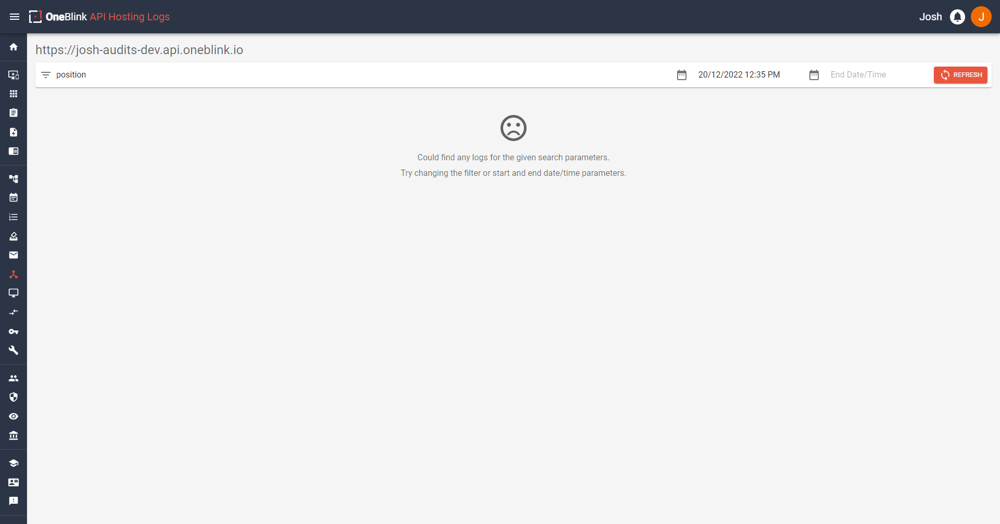
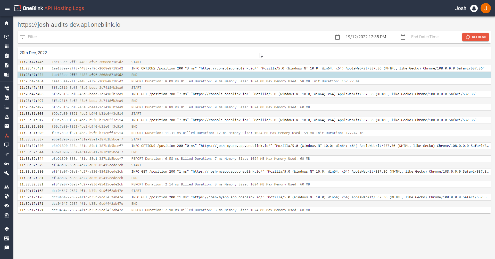

# Viewing Logs and Viewing Metrics

A keen eye would have seen in an earlier screenshots from other guides that these buttons existed on the API hosting page, which is where we will be going back to. We have both the Metrics Button and Logs button featured underneath the respective API's environment. If you had multiple environments, you would see metrics and logs buttons for each. First, let's look at the metrics page, so hit the metrics button for your hosted API!

## Metrics

You can see what the metrics screen looks like below:


On this page, from top to bottom, you can see the named API and its environment in the top left of the page. You have 5 buttons on the right, reading 60 minutes, 6 hours, 24 hours, 7 days and 30 days from left to right for time periods you can select to view the metrics of.

Additionally, you will see 3 boxes. These boxes will contain graphs or, if you're lucky enough to have no 4xx or 5xx HTTP responses, you will see a green tick with a nice message. If you are not lucky enough, these will also contain graphs that you can look at. 
These metrics can provide insight into the traffic that you are receiving from your API. 

## Logs

You can see what the logs screen looks like below:



From top to bottom again, you can see the API link with its environment in the top left then below that is a filter bar. 

Here you can filter on a search parameter, a start time, and end time and a refresh button to search with those parameters. The search parameter will let you search your API logs for those parameters and it will return any that matches. The start date time and end date time will allow you to configure the time range that you would like to investigate logs for. 

Below that, we have the area where logs are shown, in the screenshot above, you can see that it has a sad face with a message indicating that there were no logs found. You can change your time period to see if you can locate any other logs. If you have been following along, you should have some from the calls made earlier, so hit the start date and change it to yesterday, then hit refresh!

Now you will hopefully see something like this: 



When logs do appear, they are in a box and show the date they occurred up the top. There will be a box for each respective day. Looking at a row, you can see the time this occurred, the request id, and what occurred at that time. The logs will provide information regarding any information you have written to the Console via your code (through methods such as ```console.log()```, ```console.error()``` or anything equivalent.)
