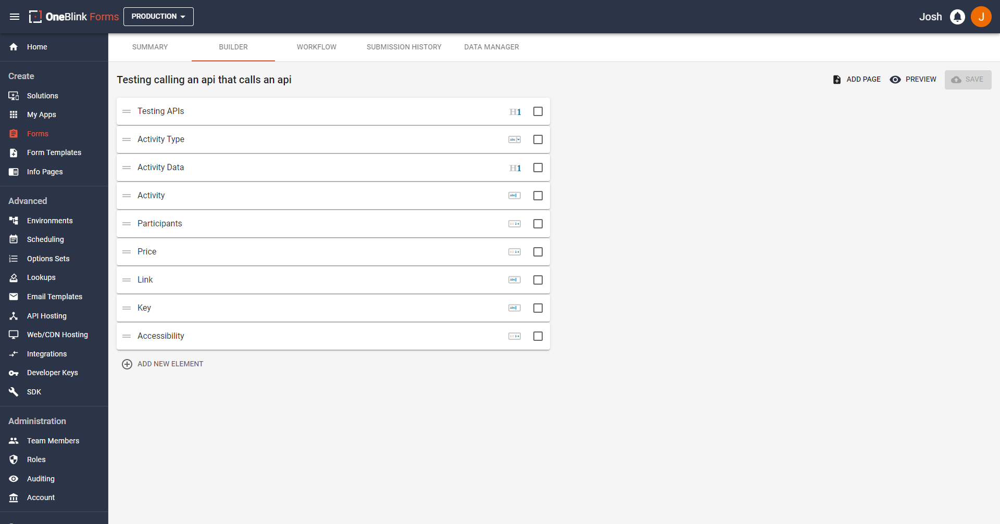
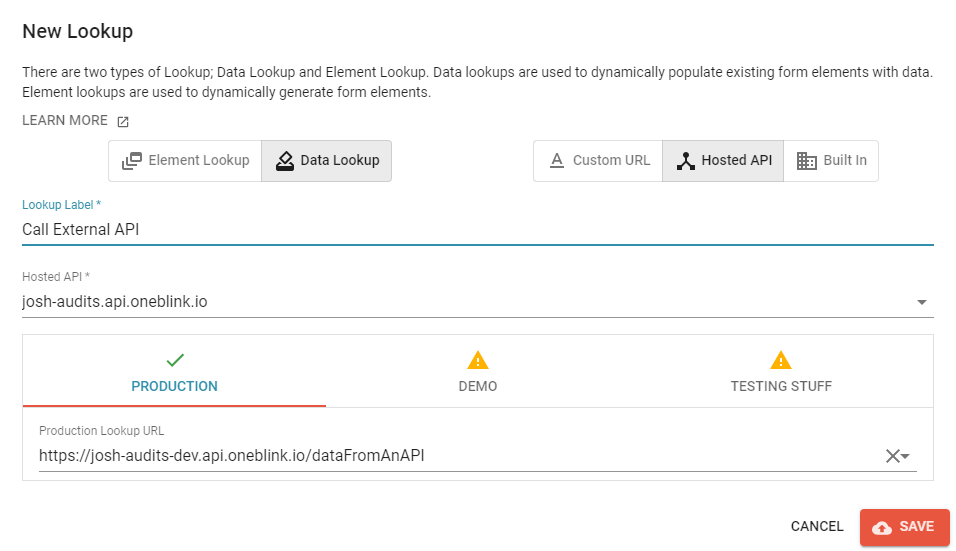
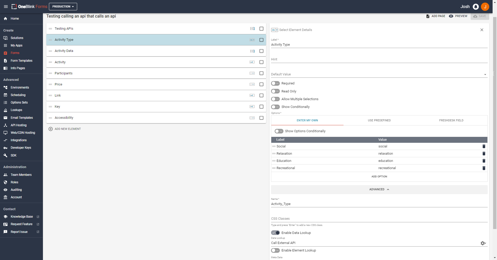
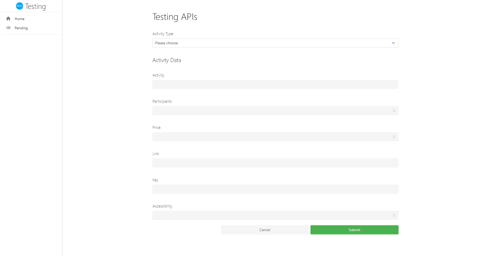

# Calling an External API for Data

Let's say you have an existing API setup that stores data. You want to grab specific data based on a form element value from an end user and want to call that API so you can grab data to return to the user to input on the form. This is something that sounds... arguably tedious but it will be very straight forward to do with this tutorial! So, let's get started with the example!

## Setting Up The Form

For this form, we can stick to a one page form. 

We are going to base the form around a free API that was found online. The api that will be used is from the website https://www.boredapi.com/. 

The endpoint we will use from this website will be: `https://www.boredapi.com/api/activity?type=:type`. A successful response from this endpoint looks like this:
```json
{
  "activity": "Learn how to play a new sport",
  "type": "recreational",
  "participants": 1,
  "price": 0.1,
  "link": "",
  "key": "5808228",
  "accessibility": 0.2
}
```

So, we will make the form have a select element where you can choose a name and pre-fill the data based on the name selected. Our select element will be named `Activity Type` and the options we will includes are:
* Social
* Relaxation
* Education
* Recreational

These can be both the labels and the options for that select element. We can make the rest of the form now, we will make the form include the following:
* Activity - Text Element
* Participants - Number Element
* Price - Number Element
* Link - Text Element
* Key - Text Element
* Accessibility - Number Element

In this example, I will make all of these elements read only too so we know only the API is filling in the data and I'm not sneakily entering in the data! 

Your form should now look something like this: 



Please make sure that your element names match here, as you will need to have the correct elements for the API code! With the form out of the way, we can now write the API Code!

## Writing The API Code

You are able to grab the code that is about to be written [by clicking here](../../examples/api/lookup/src/data-transfer.js)

The path we will take writing this code includes: 

- Make the file and write the function
- Learn more about NPM and how to install packages
- Validate the Submission data we want to use
- Call the external API for the data we need
- Format and return that data from the lookup
- Update the `.blinkmrc.json`

We will approach this step by step. 

### Make the File and Write the Function

FIrstly, let us make a new file within our API. We are going to call this file `fill-data-from-api.js`. Let us place it with any other .JS code we have written. If this is your first tutorial, it would be good to make a folder called "routes" and store your code in there.
After making the file, let us write the function now. We are going to write:

```js
module.exports.post = async function(req, res){

}
```

We have called the function `post` and given it the parameters of `req` and `res`. We write async here too as we want this function to be asynchronous, so we can utilise Promises and Awaits within our code. These are objects that we will utilise during the function. 

You can read what is included in the `Request` and `Response` objects [in our article featured here](../api/handlers.md), under the `Request` and `Response` headings. 

Please keep in mind, that there is another way of writing these functions involving ES Modules, you can see how to update the function to use that method [here](../api/upgrading-to-es-modules.md)

Now we can fill this function with some code!

### Learn more about NPM and how to install packages

Before we continue though, we have neglected something. We will need to use NPM (Node Package Manager) for this tutorial! We will need to install a specific package in order to run the code. If you do not have NPM installed, [please follow this tutorial to install it and get started](../api/beginning.md)

Now we need to open up a terminal that is directed to the folder we are currently writing this code in. If you are using VS Code, you can do this by opening up a new terminal with the keyboard shortcut: <code>crtl+shift+\`</code>. 
If you're using a Mac with VSCode, you can open a terminal with <code>command+shift+\`</code>

Once the terminal is open, we can write:
```bash
npm install node-fetch@2
```

[Node-fetch](https://github.com/node-fetch/node-fetch) is a wonderful NPM package that allows us to call endpoints, sending the necessary data alongside the call. We are installing the 2.0 specifically as the 3.0 version is only able to be used with ESModules. If you are using ESModules, you can run:

```bash
npm install node-fetch
```

Now in your folder, you should see a `package.json` and a `package-lock.json` file. After running this, these files will make their new home in your folder. `package.json` can hold a variety of information regarding the node packages you have installed, the scripts you have to run the code and other data regarding the project itself. `package-lock.json` holds more information regarding what packages have been installed, including their meta data and the packages they require in order to work correctly. You can learn about `package.json` and `package-lock.json` [at the website here](https://docs.npmjs.com/cli/v9/configuring-npm/package-json)

Now we have learnt to install packages, we have everything we need to continue writing the function!

### Validate the submission data we want to use

Upon selecting the element that we want to use with the lookup on the Form, data will be sent to the API to this function we are writing with the `req` object. We can access the submission data by writing: 

```js
req.body.submission.ELEMENT_NAME_HERE
```

However, we can't be certain that a user has inputted the correct data we need BEFORE running the lookup, so we will write some validation to ensure that has a user has entered the details and will not cause an error to occur with our code.

```js
  if (
    !req.body ||
    !req.body.submission ||
    !req.body.submission.Activity_Type
  ) {
    return res.setStatusCode(400).setPayload({
      message:
        "Error, you did not selected any activity type",
    });
  }
```

The `if` statement will check to ensure that the user has entered the data. If they have not, we use the `res` object to `setStatusCode()` to 400 first. If you want a different status code, you can find more codes by searching for the [HTTP Status Codes here](https://developer.mozilla.org/en-US/docs/Web/HTTP/Status) and change the status code to what you believe best suits the situation you need the error for. It would be best to stick to 4xx and 5xx status codes if you want to throw errors.

After we have set the status code, we can then `setPayload()` to set the payload that is returned to the Form. In this case, we will set a `message:` in an object that will return to the user. The message can be whatever you want it to be, in this case, we will write a specific message so the user knows that they must select a Full Name option.

If the user passes the validation, we can now grab the data we need by writing:
```js
const activityType = req.body.submission.Activity_Type;
```

Now it's time to call the API!

### Call the External API for the data we need

In order to call the API, we will first need to import the package we installed earlier. We can do this by writing at the start of the file:

```js
const fetch = require('node-fetch')
```
If you are using ESModules, you can instead write

```js
import fetch from 'node-fetch';
```

After this, we can then use fetch in our code! We will use it by writing:

```js
const response = await fetch(
  `https://www.boredapi.com/api/activity?type=${activityType}`,
  {
    method: "GET",
  }
)
```

Now, we need to grab the data that returned from the call, we can do this by running response.json(), shown below:

```js
const activityReturned = await response.json();
```

The data that is returned from this API looks like this:
```json
{
  "activity": "Learn how to play a new sport",
  "type": "recreational",
  "participants": 1,
  "price": 0.1,
  "link": "",
  "key": "5808228",
  "accessibility": 0.2
}
```

We have now gotten our data from the API! Hooray! 
But, what if we hadn't? Hooray... question mark?

We can't assume that we will ALWAYS get a response of data, so we once again need error handling! This time we will just write:
```js
if (!activityReturned){
    return res.setStatusCode(400).setPayload({
        message: "Error, nothing returned from the API."
    })
}
```

This will ensure that if there is no data returned from the API, we will not face issues where a user is able to throw random errors due to somehow getting a null/undefined/unknown/etc. response from the API. We need to have a person for our next step or we will face issues! 

Now that we have covered that, let us write the last part of the lookup!

### Format and return that data from the lookup

We have the data we require, we need to now return it for the user. We can do this by writing this following code:
```js
return res.setStatusCode(200).setPayload({
  activity: activityReturned.activity,
  participants: activityReturned.participants,
  price: activityReturned.price,
  link: activityReturned.link,
  key: activityReturned.key,
  accessibility: activityReturned.accessibility,
});
```

Now, we are returning the specific data in the payload for the user. We are returning the data in the specific spots we want them on the form, hence we are matching up what we grabbed from the API Object and placing as the value for specific form elements. Now we get to update the `.blinkmrc.json` file to complete this process. 

### Update the `.blinkmrc.json`

For us to use this new code we have written, we need to update the `.blinkmrc.json` file, so let us open it and add some new json to our `routes`. 
You can copy below but we are going to add this:

```json
{
  "route": "/data-from-external-api",
  "module": "./src/fill-data-from-api.js"
}
```

In this case, I stored my code in the folder path mentioned above. It's folder scheme would look something like this from the root folder of the API:

```
|-- project-root
|   |-- .blinkmrc.json
|   |-- src
|   |   |-- routes
|   |   |   |-- fill-data-from-api.js
```

## Using the new Code on the Console

Now that we have written all of this code, we can now deploy it to the Console. If you have not hosted an API via OneBlink before, you can [follow this article here to understand how](../api/hosting-api.md).

Now that the API has been hosted, we can go onto the Console and create a lookup for this data. 

Firstly, let us click on "Lookups" on the side bar under the "Developer Tools" options. On the new screen, hit the plus button on the bottom right.

You will want to click "Hosted API" on the right, enter any label you want, choose the Hosted API you updated and select the endpoint we just wrote. It should look similar to this screenshot below: 



Now, let us go back to the form we created prior. 

Let us go back to our Activity Type element. Here we can enable the data lookup here. Let us enable it under the advanced options and selecting the data lookup that we just created like in the screenshot below.



After this, let's test our new form! Looking at the gif below:



Hooray! It worked! Now we are able to call external endpoints to put data into our OneBlink form! It is good to know that this will work with many different end point that returns data, following these steps will allow you to pre-fill the form with the information you desire. 