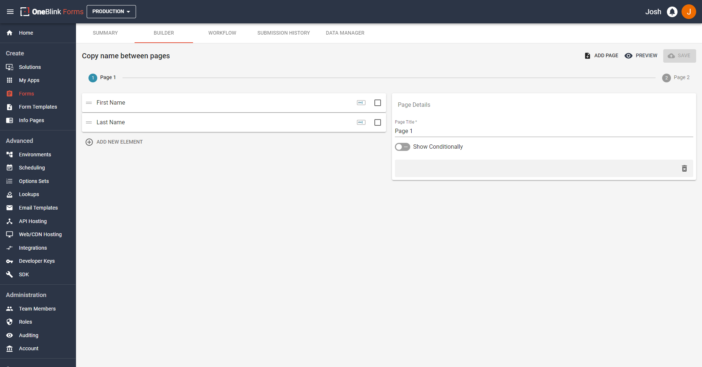
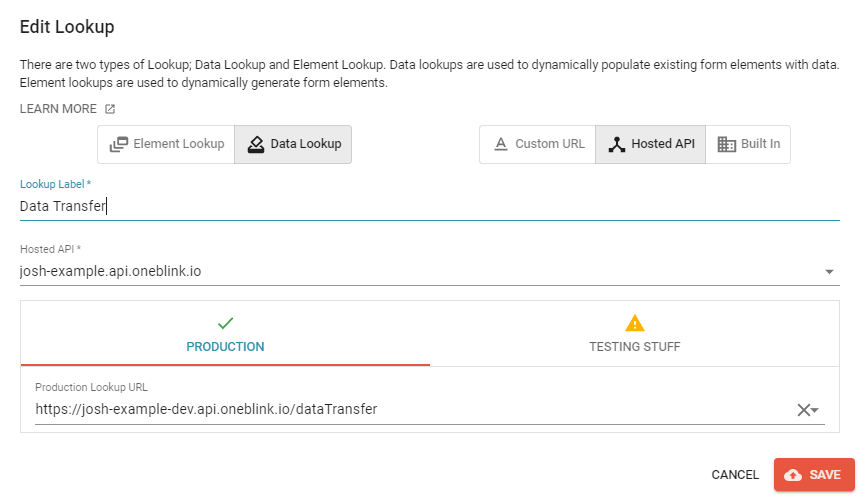
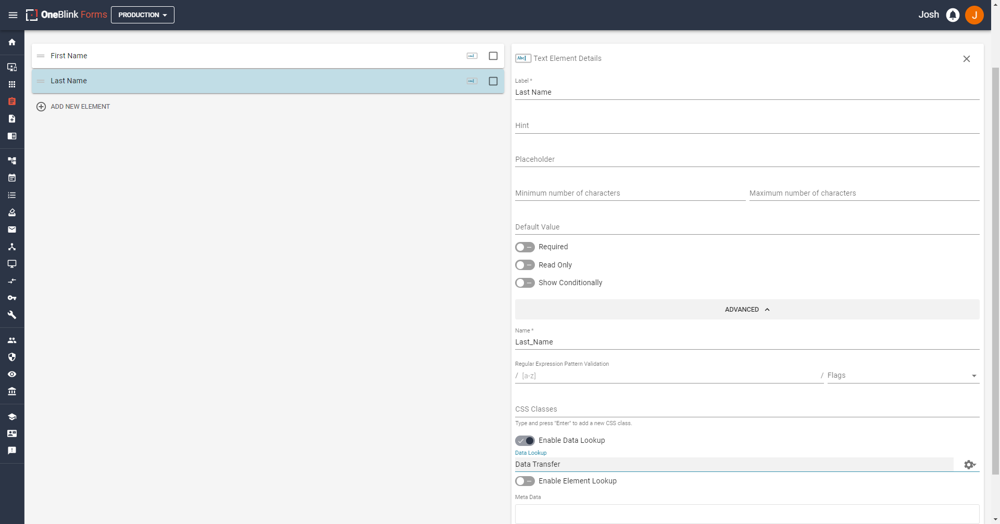
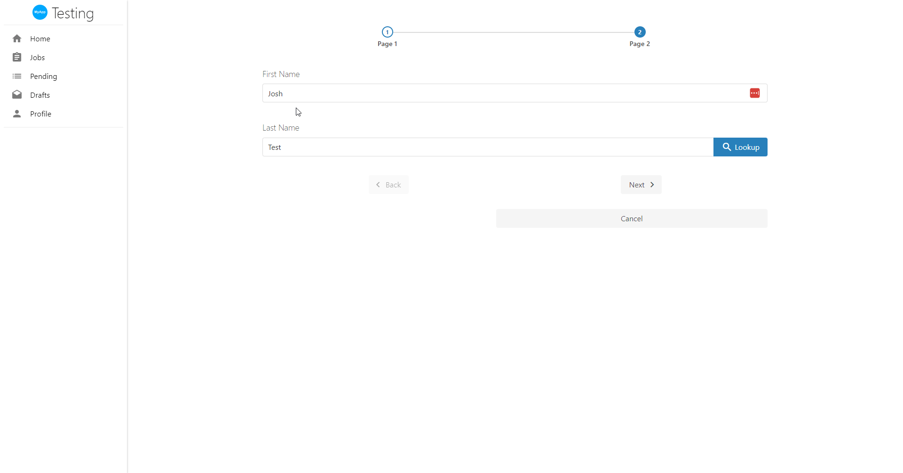

# Transferring Data Between Form Pages

Let's say you have a form where a user will have to enter their name on 3 different pages, their phone numbers on 2 different pages, and more similar data on other pages. This can be annoying for users having to re-enter the right information on each page. We can use lookups with a hosted API to save the user's fingers from typing out the same information they have entered before. So, let's get started with the example!

## Setting Up The Form

For this form, we are going to set up a simple 2 page form.

The form we will setup will have a text element labelled "First Name" and a text element labelled "Last Name" on the first page. On the second page, there will be a text element labelled "Full Name". You can see this in the screenshots below.

 
 

Additionally, when we call Form Elements in code, we do not name them based on their `label` but based on their `name`. You can find an element's name under the advance options on the platform. An example of this is shown below:

[Picture of a Form Element](../pics/FormElementName.png)

Element names are automatically pre-filled based on label input. For example, Full Name will become Full_Name. Certain characters will be removed and capitalisation will be followed with spaces replaced by underscores. Make sure you check your element name when writing code so you do not use the element's label or the wrong name.

Now that we have the form setup, we can get onto writing the API Code we will need.

## Writing the API Code

You are able to grab the code that is about to be written [by clicking here.](../../examples/api/lookup-data-transfer)

The path we will take writing this code includes:

- Make the file and write the function
- Validate the Submission data we want to use
- Set the data to the correct elements
- Return the data from the lookup
- Update the `.blinkmrc.json`

Let us go through this step by step.

### Make the File and Write the Function

Firstly, let's make a new file in our API. For simplicity sake, let's call it `data-transfer.js`. Let us place it with our other .JS code. If this is your first tutorial, it would be good to make a folder called "routes" and store your code in there.
After making the file, let us write the function now so you can copy this:

```js
module.exports.post = function (req, res){

}
```

We have called the function `post` and given it the parmameters of `req` and `res`. These will be objects that we will utilise during the function.

You can read what is included in the `Request` and `Response` objects [in our article featured here](../api/handlers.md), under the `Request` and `Response` headings.

Please keep in mind, that there is another way of writing these functions involving ES Modules, you can see how to update the function to use that method [here](../api/upgrading-to-es-modules.md)

Now we can start to fill this function with some code!

### Validate the submission data we want to use

Upon hitting the button to run the lookup to run on the Form, data will be sent to the API to this function we are writing with the `req` object. We can access the submission data by writing:

```js
req.body.submission.ELEMENT_NAME_HERE
```

However, we can't be certain that a user has filled in this information BEFORE hitting the button, so we will write some validation to ensure that the user has entered these details.

```js
  if (
    !req.body ||
    !req.body.submission ||
    !req.body.submission.First_Name ||
    !req.body.submission.Last_Name
  ) {
    return res.setStatusCode(400).setPayload({
      message:
        "Error, you did not enter any data into First Name or Last Name. Please enter data here.",
    });
  }
```

The `if` statement will check to ensure that the user has entered the data. If they have not, we use the `res` object to `setStatusCode()` to 400 first. If you wanted a different status code, you can find more based on the HTTP Status Codes and change the status code to what you believe suits the situation you need the error for. Additionally, there are also NPM libraries that can do this for you, one example is `@hapi/boom` (link to it here.).

After we set the status code, we can then `setPayload()` to set the payload that gets returned, to which we set a `message:` that will return to the user. The message can be whatever you want it to be, in this case, we will write a specific message so the user knows what they values they need to fill.

### Set the data to the correct elements

Now we know we have our data, let's set them to the correct elements! In this case, our job is quite easy, we will just need to create a new object with the string we want for our other element.

Let us create the new object by writing

```js
  const fullName =
    req.body.submission.First_Name + " " + req.body.submission.Last_Name;
```

This should take our first and last names entered and concatenate them.

So if we wrote: `John` for the first name and `Smith` as the last name, fullName when printed should have `John Smith`!

Now we have one thing to do!

### Return the data for the lookup

It's time to return the data! Now we can do something similar that we did with the error message, we can enter:

```js
  return res.setStatusCode(200).setPayload({
    Full_Name: fullName,
  });
```

Like before, we return the `res` object with set a Status Code and the payload. This time, we are setting the element with the name `Full_Name` to the `FullName` object we created. Now, all of our code should look like this:

```js
module.exports.post = function (req, res) {
  if (
    !req.body ||
    !req.body.submission ||
    !req.body.submission.First_Name ||
    !req.body.submission.Last_Name
  ) {
    return res.setStatusCode(400).setPayload({
      message:
        "Error, you did not enter any data into First Name or Last Name. Please enter data here.",
    });
  }

  const fullName =
    req.body.submission.First_Name + " " + req.body.submission.Last_Name;

  return res.setStatusCode(200).setPayload({
    Full_Name: fullName,
  });
};
```

Now we have our full function! Time to update the `.blinkmrc.json` file!

### Update the `.blinkmrc.json`

In order for us to use this, we will need to update the `.blinkmrc.json` file, so let us open it and add some new JSON to our `routes`.
You can copy below:

```json
{
  "route": "/data-transfer",
  "module": "./src/routes/data-transfer.js"
}
```

In this case, I stored my code in the folder path mentioned above. It's folder scheme would look something like this from the root folder of the API:

```
|-- project-root
|   |-- .blinkmrc.json
|   |-- src
|   |   |-- routes
|   |   |   |-- dataTransfer.js
```

You will need to change your module path to match where you have stored the file in your API folder.

Now we need to deploy our API. If you haven't done this before, there are guides to do so in this repo, you can find [a guide here](../api/hosting-api.md).

Now we are going back to the Console to finalise our work!

## Using the new code on the Console

Now we have deployed our API, we have our form, it's time to make the lookup.

Firstly, let us click on 'Lookups' on the side bar under "Developers Tools" options. On the new screen, hit the plus button on the bottom right.

You will want to click 'Hosted API' on the right, enter any label you want, choose the Hosted API you updated and select the endpoint. It should look similar to this screenshot below: 



Now, let us go back to the Form we created prior.

If we go to the "Last Name" element, we can add the lookup here. Let us enable it under the advanced options by hitting "Enable Data Lookup" and selecting the data lookup like shown below:



After this, let's test our new form! Looking at the gif below:



Eureka! It worked! Now you know how to write a lookup to transfer data between pages!
